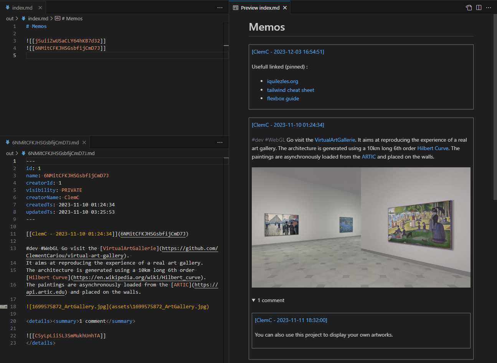

# Memos Markdown exporter

Memos exporter to Markdown (useful for Obsidian, Foam...).



## Usage

- Install the required libraries :

```sh
pip install -r requirements.txt
```

- Generate an [access token](https://www.usememos.com/docs/security/access-tokens)

- Create a `.env` file with the following parameters :

```ini
URL=https://example.com              # Base URL
TOKEN=<token>                        # Memos access token
OUT_DIR=out                          # Output folder
MEMO_QUERY=/api/v1/memo?creatorId=1  # Memos query
```

- Run the markdown exporter script :

```sh
python run.py
```
